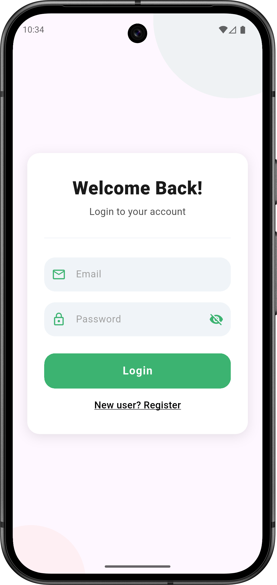
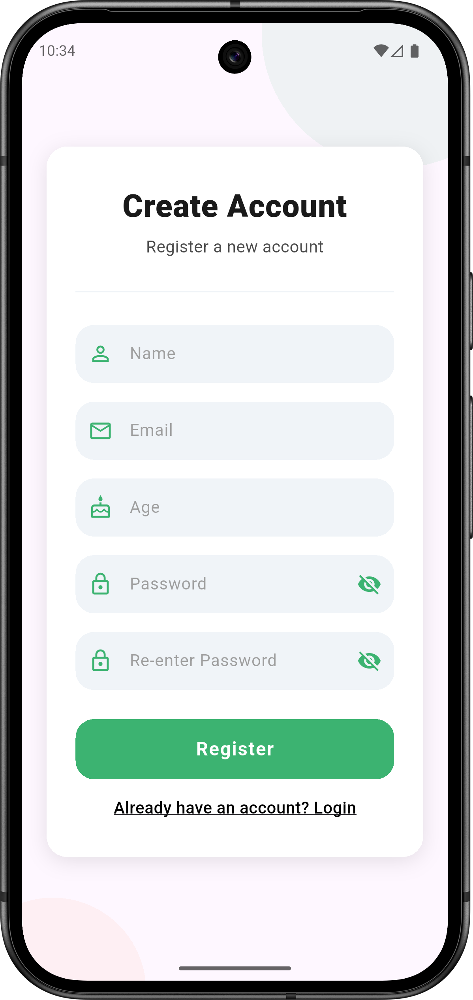

<p align="center"><em>Simple, Secure, and Fast Note-Taking with Firebase</em></p>

---

## 🚀 Overview

Notes App is a modern, user-friendly Flutter application for **Android and iOS** that allows users to securely create, edit,
and manage notes. It leverages Firebase Authentication for user management and Firebase Realtime
Database for storing notes, ensuring your data is always synced and accessible.

---

## ✨ Features

- **User Authentication**: Register and log in securely using Firebase Auth.
- **Create, Edit, Delete Notes**: Full CRUD support for your notes.
- **Realtime Sync**: Notes are instantly synced across devices via Firebase Realtime Database.
- **Per-User Data**: Each user's notes are private and securely stored.
- **Modern UI**: Clean, intuitive interface for a smooth experience.

---

## 🔥 Setup

1. Download the project from github.
2. Run the following command to install dependencies:
   ```
   flutter pub get
   ```
3. In the Firebase Console:
   - Go to the **Build** dropdown → **Authentication** → **Sign-in method**.
     - Under **Native providers**, click on **Email/Password**.
     - Enable **Email/Password** and click **Save**.
   - Go to the **Build** dropdown → **Realtime Database**.
     - Click **Create Database**.
     - Choose a location and click **Next**.
     - For security rules, select **Start in locked mode**.
     - After creation, go to the **Rules** tab and set the rules to:
       ```
       {
         "rules": {
           ".read": true,
           ".write": true
         }
       }
       ```
4. In your project folder, run:
   ```
   flutterfire configure
   ```
   - When prompted with questions, just press **n** and then **Enter**.
   - Select your Firebase project.
   - Select only **android** and **ios** platforms.
   - Press **Enter** to complete configuration.

---

## 📱 Screenshots

<p align="center">
  
  
  
  
  
</p>
